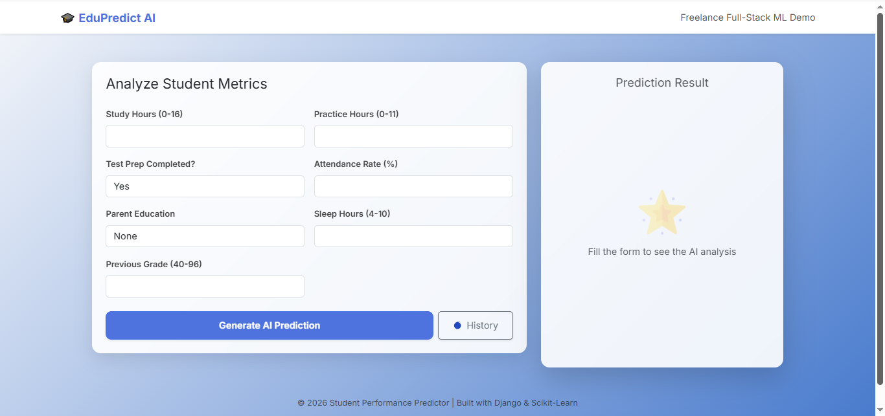
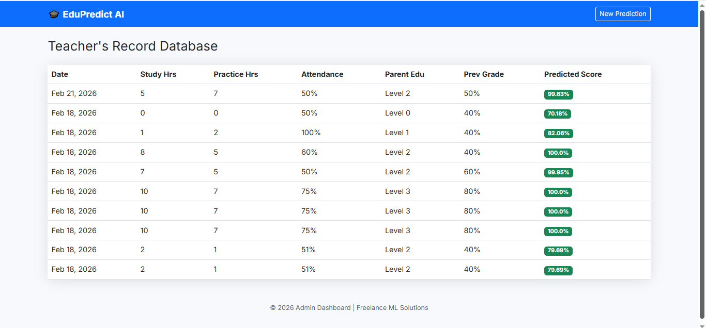

# 🎓 EduPredict AI: Student Performance Analysis System


## 🚀 Overview
**EduPredict AI** is a full-stack Machine Learning application designed to help educators and institutions predict student academic outcomes based on behavioral and historical data. By leveraging a **Random Forest Regressor**, the system provides high-accuracy math score predictions, enabling early intervention for at-risk students.

---

## 📸 Project Showroom

| Prediction Dashboard | Historical Records |
| :---: | :---: |
|  |  |

---

---

## ✨ Key Features
* **🧠 Targeted Math Prediction:** Analyzes variables like study hours and practice patterns to predict final math scores.
* **📊 Dynamic Dashboard:** A clean, modern UI built with Bootstrap 5 for a seamless user experience.
* **📜 Record Database:** Integrated SQLite database to store and review past prediction history.
* **🛡️ Data Validation:** Robust Django-form handling to ensure data integrity and model stability.
* **📱 Fully Responsive:** Optimized for desktop, tablet, and mobile views.

---

## 🛠️ Tech Stack
| Layer | Technology |
| :--- | :--- |
| **Backend** | Python 3.x, Django 5.x/6.x |
| **Machine Learning** | Scikit-Learn, Pandas, Joblib |
| **Frontend** | HTML5, CSS3 (Inter Font), Bootstrap 5 |
| **Database** | SQLite |

---

## 📂 Project Structure
* `AI_engine/` - Model training notebooks, `.pkl` files, and data visualizations.
* `Web_app/` - Full Django project including `manage.py`, `predictor` app, and templates.
* `requirements.txt` - All necessary Python libraries for one-click setup.
---

## ⚙️ Installation & Setup
1. **Clone the repository:**
```bash
git clone [https://github.com/Isha-Maryam/Student_performance_project.git](https://github.com//Isha-Maryam/Student_performance_project.git)

```

2. **Setup Virtual Environment:**
```bash
python -m venv venv
source venv/bin/activate  

```


3. **Install Dependencies:**
```bash
pip install -r requirements.txt

```


4. **Run Migrations & Server:**
```bash
python manage.py migrate
python manage.py runserver

```
---

## 📈 ML Model Details

The underlying model is a **Random Forest Regressor** trained on features including:

* 📖 Study Hours & Practice Hours
* 🏫 Attendance Rate
* 🎓 Parent Education Level
* 😴 Sleep Patterns
* 📉 Previous Grade Averages

---

## 💼 Project Purpose & Technical Vision
This project was developed as a **Technical Proof of Concept (PoC)** to demonstrate the integration of Machine Learning within a Full-Stack architecture. 

* **Practical Learning:** Built to master the end-to-end pipeline of data processing, model serialization, and backend integration.
* **Bridge between AI & UX:** Showcases how complex predictive models (Random Forest) can be translated into a user-friendly interface.
* **Scalable Foundation:** Designed with a modular "AI Engine" and "Web App" structure, making it ready for future cloud deployment or mobile integration.

---

## 📧 Contact & Connect

**Isha Maryam** *ML | Deep Learning | Full-Stack Developer*

[](https://www.linkedin.com/in/isha-maryam-84ab8a327)
[](https://isha-maryam-ai-engineer.web.app/)

> **"Turning complex data into intelligent solutions. Let's build the Something together!"**


